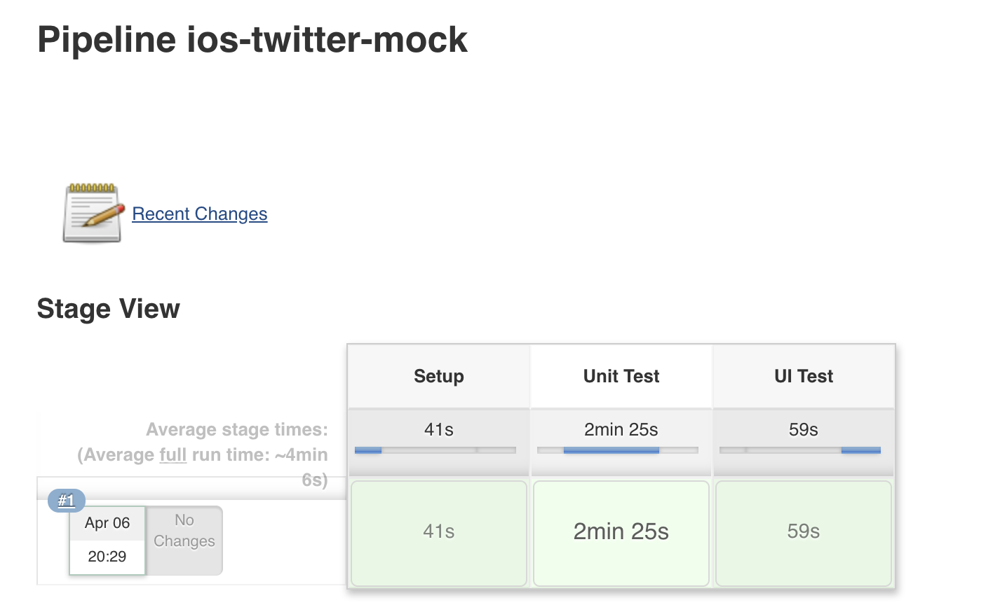

# Requirements
* Xcode 10.2
* Swift 5

# Frameworks
| Framework | Usage | Detail |
| ------ | ------ | ------ |
| [RxSwift](https://github.com/ReactiveX/RxSwift) | Swift version of Rx|  |
| [RealmSwift](https://github.com/realm/realm-cocoa)   [RxRealm](https://github.com/RxSwiftCommunity/RxRealm)| Mobile database | 1. Easy set up   2. Better support Rx   3. Cross platform support(Such as Android)   4. Faster performance   5. Easy encrpytion   6. Free   7. No limit to data storing |
| [KeychainAccess](https://github.com/kishikawakatsumi/KeychainAccess) | Swift wrapper for Keychain | Use for saving database encryption key |
| [Swinject](https://github.com/Swinject/Swinject)   [SwinjectStoryboard](https://github.com/Swinject/SwinjectStoryboard) | Lightweight **Dependency Injection (DI)** framework for Swift. |  Implements **Inversion of Control (IoC)** for resolving dependencies. Swinject helps your app split into loosely-coupled components, which can be developed, tested and maintained more easily.  |
| [SDWebImage](https://github.com/SDWebImage/SDWebImage) | Async image downloader with cache support |  |

# Code Structure
**Model-View-ViewModel (*MVVM*)** Design Pattern
## Model
`Feed`, `User` are models used in UI layer.

`FeedRM`, `UserRM` are realm object, which are strictly used in database layer.
## ViewModel
Contains series of observables, which are ready to display, or only need simple compute logic.

Send request to service layer, but not process heavy business logic.
## Controller and View
Layout views if necessary, bind to display series of observables. Should not contains any business logic.

## Interactor
Process specific business rule(or single user case)

## Adapter
Wrapper classes for realm or keychain, which can be reused.

# Others
* Use storyboard **Auto Layout**, reduce code lines
* Use **Collection View**, which is more powerful and flexible than table view

# Mock Server
| Protocols | Methods | Details |
| ------ | ------ | ------ |
| `MockTokenService` | `getToken()` | Mock server to generate token |
| `MockServerService` | `signUp()`   `signIn()`   `getFeeds()`   `postFeed()` | `getFeeds()`:   Every company has specific policy to query newest info(such as by created time), in this mock we will query by id |
 
# Test
## Unit Tests
24 tests
## UI Tests
1 test
## Integration
**Jenkins** and **Fastlane**

